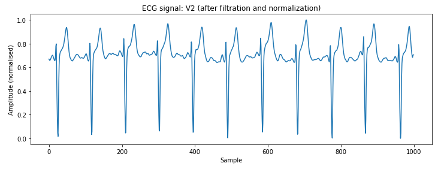

# Project for Data Scientist Beginner

## Table of Contents
1. [Introduction](#introduction)
2. [Technologies](#technologies)
3. [Setup](#setup)
4. [Implemented Features](#implemented-features)
5. [Process and Execution](#process-and-execution)
6. [Status of Project](#status-of-project)

## Introduction
The objective of this project is to address several tasks typical for a data scientist working with the PTB-XL dataset. As my first project, I have encountered challenges such as noise filtering and anomaly detection in ECG signals. My goal is to demonstrate basic skills and problem-solving abilities with the help of tools like ChatGPT and the StackOverflow community.

## Technologies
The project has been created in Python 3.8.5 in Jupyter Notebook environment. Following libraries with versions were used:
- Pandas 1.1.3
- Numpy 1.21.0
- Matplotlib 3.3.2
- Scikit-learn 0.23.2
- Wfdb 4.1.2
- Scipy 1.5.2.

## Setup
This project requires the PTB-XL dataset to be installed on your local machine. You can download it from [PhysioNet](https://physionet.org/content/ptb-xl/1.0.3/). The code for this project is located in the file named `projekt1.ipynb` within this repository. To ensure the code functions correctly, update the `data_folder_path` variable in the code to match the directory where your dataset is stored.

## Implemented Features
- Loaded the dataset and removed outliers.
- Visualized ECG signals.
- Checked the dataset for any missing values.
- Attempted to classify health conditions based on ECG signals. Unfortunately, this part was unsuccessful due to a technical issue with loading the appropriate records from the dataset.
- Performed noise filtering, ECG signal segmentation, and anomaly detection.
- Extracted features from the signals and their anomalies.
- Compared the effectiveness of various signal detection algorithms.

## Process and Execution
1. The dataset was loaded using the built-in `pd.read_csv()` function. Next, **outliers** need to be removed from the dataset. The `remove_outliers` function is designed to filter out outliers from a given signal based on the Interquartile Range (IQR) method. It works as follows:

   - The function calculates the first quartile (Q1) and the third quartile (Q3) of the signal, which represent the 25th and 75th percentiles, respectively. These quartiles help identify the central portion of the data.
   
   - Next, the Interquartile Range (IQR) is computed as the difference between Q3 and Q1. The IQR measures the spread of the middle 50% of the data.
   
   - The function then calculates the lower and upper bounds using the IQR and a specified threshold (default is 1.5). These bounds define the acceptable range for data points:
     - **Lower Bound:** `Q1 - (IQR * threshold)`
     - **Upper Bound:** `Q3 + (IQR * threshold).`

   - The next step is to create a mask to identify the data points within these bounds.
   
   - Finally, the function returns a cleaned version of the signal, containing only the data points that lie within the calculated bounds.
2. The `load_and_plot_record` function is created to visualize data — specifically, ECG signals. It performs the following steps:
- **Path Construction:**  
   The function constructs the file paths for the `.dat` and `.hea` files associated with the ECG record based on the provided folder path, subfolder, and record name.

- **File Existence Check:**  
   It verifies whether the required `.dat` and `.hea` files exist. If either file is missing, an appropriate error message is printed, and the function exits.

- **Load ECG Record:**  
   Using the `wfdb` library, the function loads the ECG record, specifying the channels to be read. It prints key information about the record, including the record name, number of signals, sampling frequency, and signal length.

- **Clean Signals:**  
   Each signal in the record is cleaned by removing outliers using the previously made `remove_outliers` function. Signals that have been successfully cleaned are collected for further processing.

- **Trim Signals:**  
   The function trims all cleaned signals to the length of the shortest signal to ensure uniformity across all signals.

- **Prepare for Plotting:**  
   The cleaned signals are converted from a list to a NumPy array for easier manipulation and plotting.

- **Plot Signals:**  
   For each cleaned signal, the function generates a plot using the 'plot()' function from the Matplotlib library. The plot displays the ECG signal's amplitude over time, with appropriate labels and titles.

- **Error Handling:**  
   Any exceptions encountered during the loading, cleaning, or plotting process are caught, and an error message is printed.
This is an example of result of the function. Note that this is only one of twelve plots, because each record has twelve chanals.*Fig.1: One of twelve signals.*
3. Afterwards, the 'check_missing_values_in_signals' function was created. Its purpose is to check whether some of the data are missing (NaN) based on NumPy's 'np.isnan()' function, which verifies if the values are present or not. Depending on the outcome, an appropriate message is printed. This function is then applied to each ECG record in the dataset. The script iterates through all records in the specified directories, loads each record, and uses the 'check_missing_values_in_signals' function to identify any records containing missing values. Upon activation of the code, no messages were printed, indicating that there are no missing values in the dataset. This result was expected and is positive, as it means there are no missing values to handle or clean.
4. The next task was to classify health conditions based on ECG signals. To do this, a new `diagnosis` column was added to metadata and the `map_scp_to_diagnosis_weighted` function is responsible for that. Mentioned column is based on the `scp_codes` one and its purpose is to disclose the health condition of examined people. It is worth noting that all information is already included in the `scp_codes` column; however, the values are coded, so they are difficult to read.

   First, the `scp_to_diagnosis` dictionary maps SCP codes to human-readable diagnoses. For example, the NORM code corresponds to the diagnosis "healthy," and MI corresponds to "heart attack."

   The `map_scp_to_diagnosis_weighted` function takes a dictionary of `scp_codes`, where the keys are SCP codes, and the values are the weights indicating the significance of each code for the record. Note that every value in the `scp_codes` column is a dictionary of diverse lengths, in which every ailment has an assigned value. The following picture illustrates this fact:
*Fig.2: Some of metadata.*
   The function iterates through all SCP codes in the record. For each code, it checks if it exists in the `scp_to_diagnosis` dictionary and compares its weight with the highest weight encountered so far. If the SCP code is present in the dictionary and its weight is greater than the previously encountered weight, the function updates the assigned diagnosis and records the new highest weight. If none of the codes have a significant weight or are not found in the dictionary, the function returns the default value "other". In cases where a record has two or more keys with identical and the highest values, only the first encountered one is considered, which might be a simplification. The function returns the diagnosis with the highest weight among the SCP codes associated with the record.
   Next, the `load_and_clean_record` function was applied. It operates similarly to `load_and_plot_record`, but it does not plot.

   The `prepare_data_for_model` function is designed to prepare input data for a machine learning model by transforming ECG signals and their corresponding diagnoses into a format ready for model training. The function begins by creating two empty lists, `X` and `y`. The `X` list will store the feature vectors (ECG signals), while the `y` list will contain the labels (diagnoses) corresponding to those signals.

   The function then iterates through all records in the `metadata_df` DataFrame, which contains information about the ECG signals, such as filenames and assigned diagnoses. For each record, the function constructs the full path to the corresponding ECG signal file using the filename stored in the `filename_lr` column and the provided folder path. The function then attempts to load the ECG signal using the `load_and_clean_record` function. If the signal is successfully loaded and processed (i.e., it is not None), the signal is "flattened" into a single feature vector and added to the `X` list. The diagnosis label corresponding to the signal is added to the `y` list. After processing all records, the function returns `X` and `y` as NumPy arrays, ready for use in a machine learning model.

   Data was then split into 80% training and 20% test parts and normalized. Next, a RandomForest model was used, as it is known for its versatility, popularity, and stability. Unfortunately, this task did not end well due to an error that occurred in the code, which I was unable to resolve.
5. When it comes to noise filtering, a simple function called 'moving_average' is responsible for this. The function involves smoothing the signal using the moving average method. It is based on Numpy's function 'np.convolve', which calculates the average of the signal and its four closest neighbors, controlled by the 'window_size' parameter. The number of points used to calculate the average can be changed by decreasing or increasing the 'window_size' parameter, which leads to smaller or greater smoothing of the signal, respectively. However, 'window_size' should be an odd number and should not be too large, as it might cause a loss of information. Afterwards, the signal is normalized and plotted with 'load_and_plot_record'. The following image shows the result:  
  
*Fig.3: One of twelve filtered signals.*  
Since we used the same record example as in [Figure 1](#im1), we can conclude that the signal is indeed smoother than before.
6. As part of the project, ECG signal segmentation was performed to analyze heart cycles. This segmentation allows for the extraction of individual heart cycles from the full ECG signal, which is needed for further analysis and processing. The segmentation process is implemented using several key functions in Python:
- R-Peak Detection:

    The 'detect_r_peaks' function is used to detect R-peaks in the ECG signal. The R-peak is a crucial component in ECG analysis, representing the ventricular contraction of the heart. This process involves:
Normalizing the signal to mitigate differences in amplitude.
Using the 'find_peaks' function from the 'scipy.signal' library to identify peaks corresponding to R-peaks. The 'distance' parameter sets the minimum distance between peaks, while 'height' defines the minimum peak height.
- Signal Segmentation:

    The 'segment_signal' function segments the ECG signal into heart cycles around detected R-peaks. It uses the 'window_size' parameter to determine the length of each segment. Segments are extracted based on the locations of R-peaks, ensuring that each segment contains a full heart cycle. 
- Visualization of Results:

    The 'load_segment_and_plot_record' function displays plots for each segment, allowing for visual assessment of the segmentation results, for example:
      
*Fig.3: One of twelve channels segment.*

7. Anomaly detection in ECG signals was implemented in a very simple way. It consists of the detect_anomalies function, which calculates the mean value and standard deviation of the signal. The function checks which values of the signal deviate from the mean by more than a specified threshold (in this case, three times the standard deviation). These values are considered anomalies. As before, the next function, load_detect_and_plot_record, plots the signal and anomalies on the same plot.

    While the detect_anomalies function is efficient and easy to use, it may be less effective in more complex scenarios where the signal exhibits trends, seasonality, or non-Gaussian distributions. In such cases, more advanced techniques may be required to improve the accuracy of anomaly detection.
Here is an example:
  
*Fig.3: Signal with detected anomalies.*

## Status of Project
The project has been theoretically completed, except for one non-functioning part of the code. For this reason, it may be updated in the near future to fix the malfunctioning code or to add new functionalities. This largely depends on the vision of my supervisor, whom I would like to thank for their time, motivation, and overall support. I also hope to have the opportunity to demonstrate my skills in a much better way, as I do not believe this project showcased my abilities as well as I would have liked.
